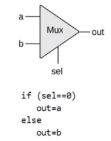
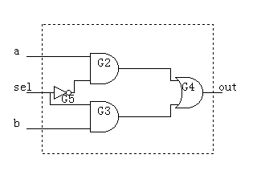
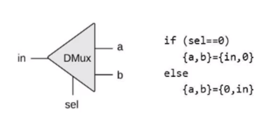
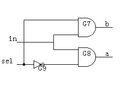
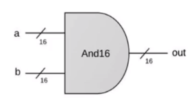
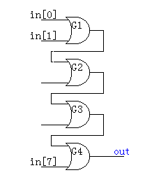
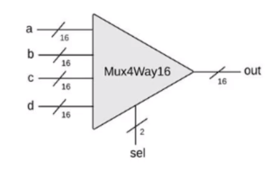
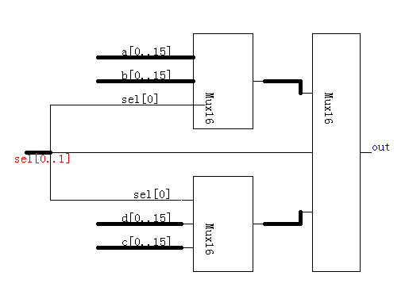
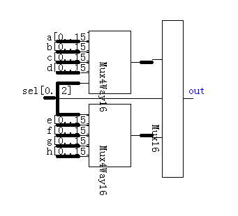
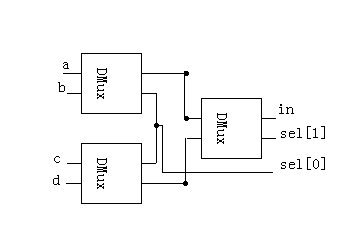

### Boolean Logic

基于基本的Nand(与非门)，实现了基本的几个逻辑单元
		
- **Not(非门)**
- **And(与门)**
- **Or(或门)**
- **Xor(异或门)**
- **Mux(选择)**




- **DMux**





- **Not16**
- **And16**
- **Or16**

描述：



实现：

16个与门并联即可


- **Mux16**

描述：
```
/**
 * 16-bit multiplexor: 
 * for i = 0..15 out[i] = a[i] if sel == 0 
 *                        b[i] if sel == 1
 */

```
实现：

16个Mux并联，sel共同使用一个即可


- **Or8Way**

描述：
```
/**
 * 8-way Or: 
 * out = (in[0] or in[1] or ... or in[7])
 */
```
实现：




- **Mux4Way16**

描述：



实现：



- **Mux8Way16**

描述：上一个的升级版8根总线，3根选择线

```
/**
 * 8-way 16-bit multiplexor:
 * out = a if sel == 000
 *       b if sel == 001
 *       etc.
 *       h if sel == 111
 */
```

实现：




- **DMux4Way**

描述：
```
/**
 * 4-way demultiplexor:
 * {a, b, c, d} = {in, 0, 0, 0} if sel == 00
 *                {0, in, 0, 0} if sel == 01
 *                {0, 0, in, 0} if sel == 10
 *                {0, 0, 0, in} if sel == 11
 */

```
实现：




- **DMux8Way**

描述：上一个的升级版

```
/**
 * 8-way demultiplexor.
 * {a,b,c,d,e,f,g,h} = {in,0,0,0,0,0,0,0} if sel==000
 *                     {0,in,0,0,0,0,0,0} if sel==001
 *                     etc.
 *                     {0,0,0,0,0,0,0,in} if sel==111
 */

```

实现：

先使用```sel```的最高位```sel[2]```进行DMux，将in分成两部分in1, in2，然后分别使用两个```DMux4way```和```sel[0..1]```。
然后对应高低位即可。