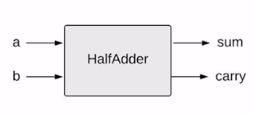
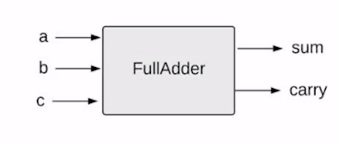
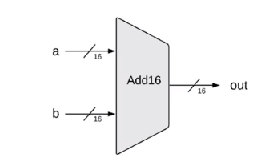
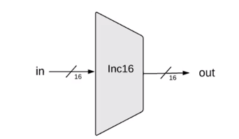
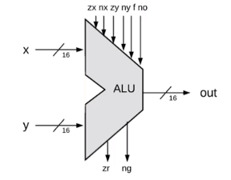
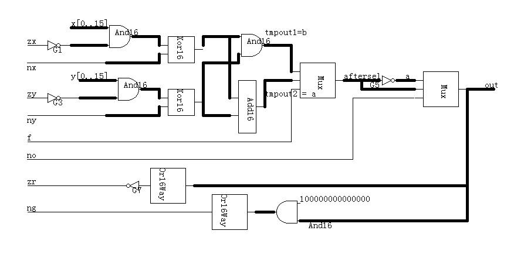

### Boolean Arithmetic

- **HalfAdder**




- **FullAdder**



- **Add16**
- 
描述：



```
The most significant carry bit is ignored.

```
实现：

串联即可。


- **Inc16**

描述：



实现：

```
Add16(0000000000000001, a) = out
```

- **ALU**


描述：





```
/**
 * The ALU (Arithmetic Logic Unit).
 * Computes one of the following functions:
 * x+y, x-y, y-x, 0, 1, -1, x, y, -x, -y, !x, !y,
 * x+1, y+1, x-1, y-1, x&y, x|y on two 16-bit inputs, 
 * according to 6 input bits denoted zx,nx,zy,ny,f,no.
 * In addition, the ALU computes two 1-bit outputs:
 * if the ALU output == 0, zr is set to 1; otherwise zr is set to 0;
 * if the ALU output < 0, ng is set to 1; otherwise ng is set to 0.
 */

// Implementation: the ALU logic manipulates the x and y inputs
// and operates on the resulting values, as follows:
// if (zx == 1) set x = 0        // 16-bit constant
// if (nx == 1) set x = !x       // bitwise not
// if (zy == 1) set y = 0        // 16-bit constant
// if (ny == 1) set y = !y       // bitwise not
// if (f == 1)  set out = x + y  // integer 2's complement addition
// if (f == 0)  set out = x & y  // bitwise and
// if (no == 1) set out = !out   // bitwise not
// if (out == 0) set zr = 1
// if (out < 0) set ng = 1

CHIP ALU {
    IN  
        x[16], y[16],  // 16-bit inputs        
        zx, // zero the x input?
        nx, // negate the x input?
        zy, // zero the y input?
        ny, // negate the y input?
        f,  // compute out = x + y (if 1) or x & y (if 0)
        no; // negate the out output?

    OUT 
        out[16], // 16-bit output
        zr, // 1 if (out == 0), 0 otherwise
        ng; // 1 if (out < 0),  0 otherwise
}
```

真值表：

实现：

文件描述，实际上就是一种提示，其实只要按照描述的顺序实现，就不会出错。

