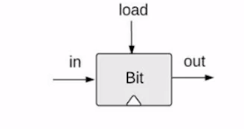
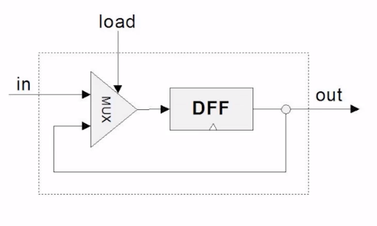
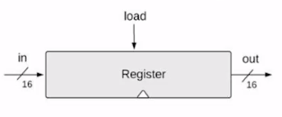
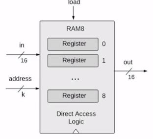
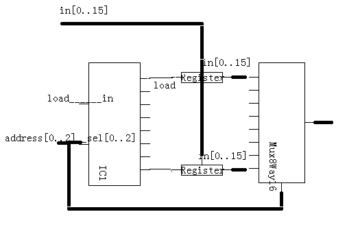
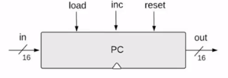
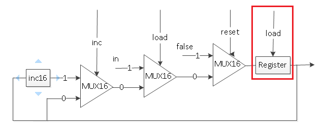

### Sequential Logic

- **DFF	Data Flip-Flop (primitive)	**

D触发器，这是这一章的基础原件.

特征：

```
out[t+1] = in[t]

```

- **Bit**

描述：


```
/**
 * 1-bit register:
 * If load[t] == 1 then out[t+1] = in[t]
 *                 else out does not change (out[t+1] = out[t])
 */

```

实现：




- **Register**

描述：



实现：

16个Bit并联，共享一个load指令位置


- **RAM8**


描述：



```
/**
 * Memory of 8 registers, each 16 bit-wide. Out holds the value
 * stored at the memory location specified by address. If load==1, then 
 * the in value is loaded into the memory location specified by address 
 * (the loaded value will be emitted to out from the next time step onward).
 */
```

实现：




- **RAM64**


描述：
```
CHIP RAM64 {
    IN in[16], load, address[6];
    OUT out[16];
}
```

实现：

模式和RAM8相同，但是将```Register```换成```RAM8```, 并将```Address[0..2]```作为每个```RAM8```的输入地址。```Address[3..5]```作为外部模式的地址。

- **RAM512**
- **RAM4K**
- **RAM16K**

以上几种实现模式相同。

- **PC**


描述：



```
/**
 * A 16-bit counter with load and reset control bits.
 * if      (reset[t] == 1) out[t+1] = 0
 * else if (load[t] == 1)  out[t+1] = in[t]
 * else if (inc[t] == 1)   out[t+1] = out[t] + 1  (integer addition)
 * else                    out[t+1] = out[t]
 */

```

实现：



我们将这个事件分为3个级别，分别使用选择器实现，误区这里的load和寄存器的load是两回事，不能混淆，寄存器的load恒为True。