# Machine Language Programming

介绍了一种汇编语言 hack 

### 计算机组成

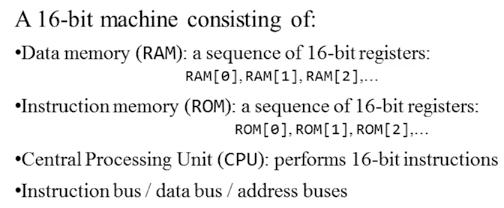

- 两种16位的指令

  - A指令
  - C指令

- 控制

指令写在RMO中，reset运行程序。

- 三个寄存器


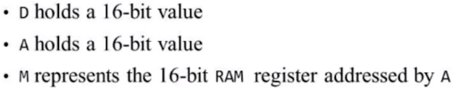


### A指令的语法
```
@value

```

value 一般情况下是一个 数字

A寄存器被设置成value
M指向RAM[21]

- 例子：RAM[100] 减一

```
@100
M=-1
```

### C指令的语法

```
dest = compute ; jump

```
dest jump是可选的

这些指令都支持哪些？

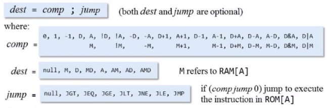

jump代表的含义：

如果计算结果满足，某个条件，那么ROM会跳转到ROM[A]指令处。

- null 不跳转
- JMP 强制跳转


- 例子： D = D - 1

```
D =- 1
```
- 例子： RAM[300] = D - 1

```
@300
M = D - 1
```

- 例子： if (D-1==0) jump to ROM[56]

```
@56
D-1; JEQ
```

### Ｉ／Ｏ相关的

- 键盘


内存中的开始的地址是24576

键盘只占用一个16位的寄存器，一个地址位，Hack会检测外部的键盘按键，同时将按键对应的值，放到```Register```中，可以当成一个黑盒使用

- 屏幕

内存中的开始的地址是16384

屏幕大小是```0-511 * 0-255```，黑白显示，每行需要32个16位的Register。

一共256行，因此需要 8192 个连续的Regsiter。

屏幕会实时的刷新 8192 个寄存器的内容，并显示到屏幕。


### 深入的理解HackLanguage

- 操作内存

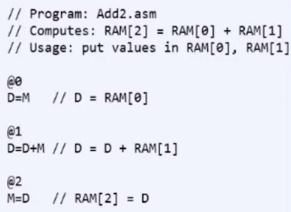

  - 注：行号在真正加载到计算机中的时候，是重新排布的。

- 如何结束一个程序

制造一个死循环

```
@6
0; JMP
```

- 内置的助记符号


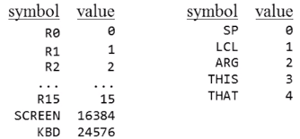


- 条件语句

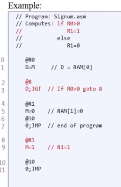

为了不要在记忆行号，可以定义LABEL。

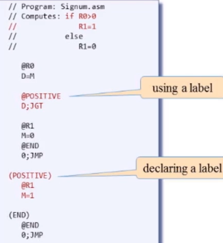


- 变量


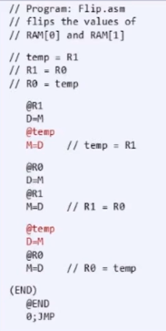

汇编器会从16开始寻找可用的变量位置。


- 迭代

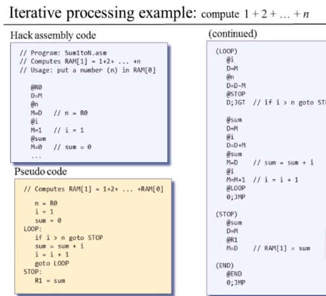


- 指针

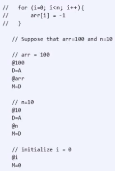
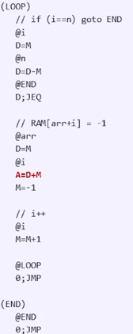

- I/O

课程项目

```
// Runs an infinite loop that listens to the keyboard input. 
// When a key is pressed (any key), the program blackens the screen,
// i.e. writes "black" in every pixel. When no key is pressed, the
// program clears the screen, i.e. writes "white" in every pixel.

// Put your code here.

//检测键盘KBD寄存器是不是0，如果是0，执行全部写满屏幕黑色的命令
//如果键盘寄存器不是0，

//主循环
(LOOP)

//键盘检测其实是一个瞬间的事件，因为刷新屏幕需要很长的时间

@KBD
D=M
@BLACKEN
D;JGT

@KBD
D=M
@WHITE
D;JEQ

@LOOP
0;JMP

//设置
(BLACKEN)

@SCREEN //设置屏幕的起点arr = 屏幕起点
D=A
@arr
M=D

@8190
D=A
@n
M=D

@i
M=0

(LOOPINBLACK)

//判断i和n的大小关系
@i
D=M
@n
D=D-M
@LOOP
D;JEQ

//开始设置黑色

@arr
D=M

//如果是比较复杂的数字可以采用下面的解决方案

//@i
//D=D+M //D存放的是操作的地址
////先将地址放到一个临时变量里面
//@tmp
//M=D

//@32767 //这里需要设置成
//D=A

//@tmp
//A=M
//M=D

//因为是-1，所以可以直接设置
@i
A=D+M
M=-1

// i++
@i
M=M+1

@LOOPINBLACK
0;JMP

(WHITE)
//为了方便观察省略这个函数
@LOOP
0;JMP
```

