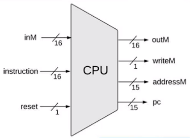
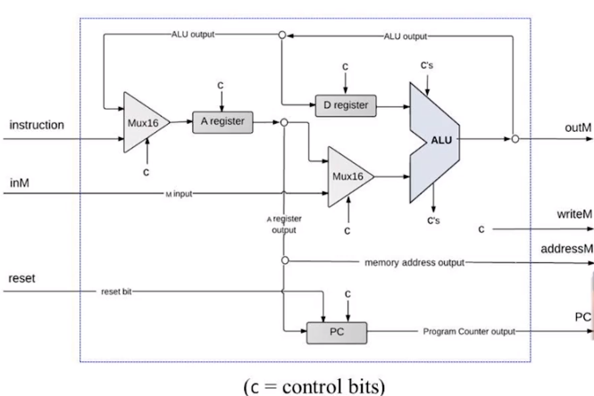
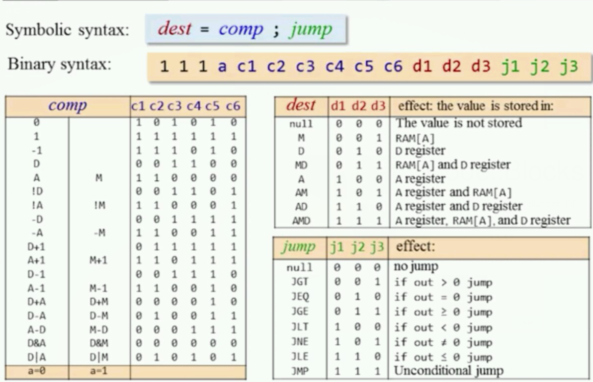
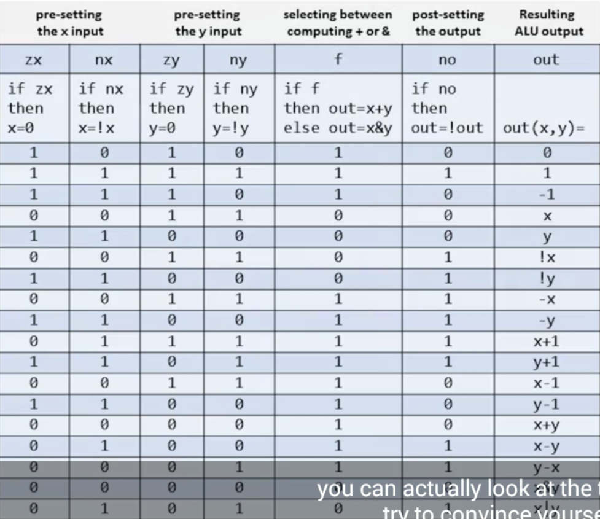
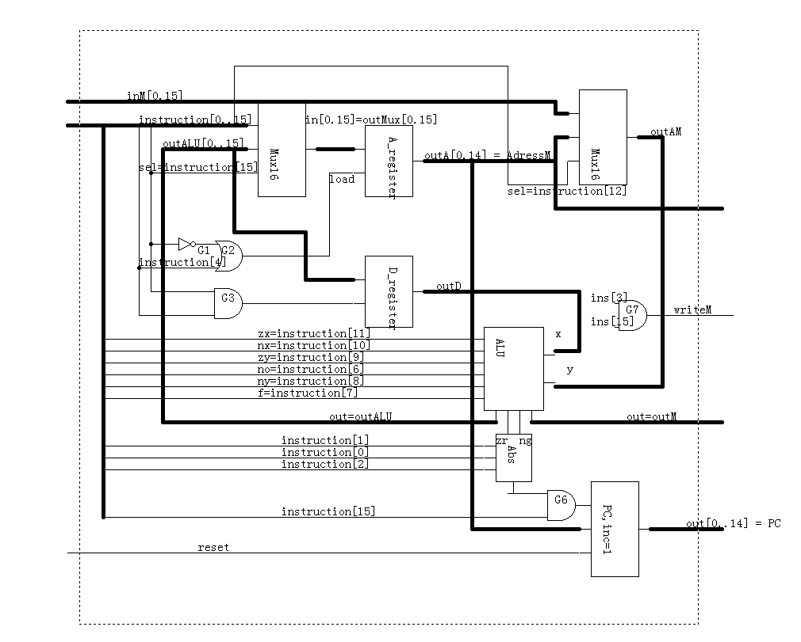
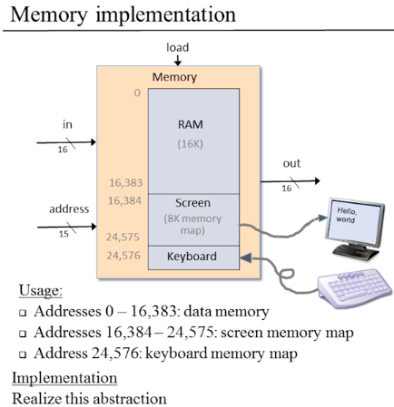
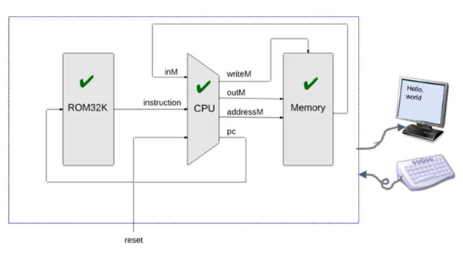

# Computer Architecture


### CPU


描述：

```
/**
 * The Hack CPU (Central Processing unit), consisting of an ALU,
 * two registers named A and D, and a program counter named PC.
 * The CPU is designed to fetch and execute instruction written in 
 * the Hack machine language. In particular, functions as follows:
 * Executes the inputted instruction according to the Hack machine 
 * language specification. The D and A in the language specification
 * refer to CPU-resident registers, while M refers to the external
 * memory location addressed by A, i.e. to Memory[A]. The inM input 
 * holds the value of this location. If the current instruction needs 
 * to write a value to M, the value is placed in outM, the address 
 * of the target location is placed in the addressM output, and the 
 * writeM control bit is asserted. (When writeM==0, any value may 
 * appear in outM). The outM and writeM outputs are combinational: 
 * they are affected instantaneously by the execution of the current 
 * instruction. The addressM and pc outputs are clocked: although they 
 * are affected by the execution of the current instruction, they commit 
 * to their new values only in the next time step. If reset==1 then the 
 * CPU jumps to address 0 (i.e. pc is set to 0 in next time step) rather 
 * than to the address resulting from executing the current instruction. 
 */
//这个应该是最难的，原理很简单，但是自己写了好几遍，始终不知道错误在哪儿，最后参考了别人的答案
CHIP CPU {

    IN  inM[16],         // M value input  (M = contents of RAM[A])
        instruction[16], // Instruction for execution
        reset;           // Signals whether to re-start the current
                         // program (reset==1) or continue executing
                         // the current program (reset==0).

    OUT outM[16],        // M value output
        writeM,          // Write to M? 
        addressM[15],    // Address in data memory (of M)
        pc[15];          // address of next instruction
}

```




实现：

16位的指令

如果最高位是0那么这是一个A指令，剩余的15位代表地址。
如果最高位是1那么这是一个C指令。




```
// Put your code here:
//根据指令的类型判断是从alu写入(C指令)，还是从指令中读入(A指令)
Mux16(a=instruction,b=outALU,sel=instruction[15],out=outMux1);

//Register A
Not(in=instruction[15],out=notAnd);
Or(a=notAnd,b=instruction[5],out=outOr);
//A寄存器的开启条件，A指令 或者 C指令并且允许alu写入到A寄存器的控制位允许
ARegister(in=outMux1,load=outOr,out=outA,out[0..14]=addressM);

//D寄存器同理：只能是C指令下的控制位允许的条件才行
And(a=instruction[15],b=instruction[4],out=loadD);
DRegister(in=outALU,load=loadD,out=outD);

//Mux A&M
Mux16(a=outA,b=inM,sel=instruction[12],out=outAM);

//ALU
ALU(x=outD,y=outAM,zx=instruction[11],nx=instruction[10],zy=instruction[9], 
ny=instruction[8], f=instruction[7], no=instruction[6],
out=outALU,out=outM,zr=zr,ng=ng);

//Mux writeM
And(a=instruction[3],b=instruction[15],out=writeM);


//PC，通过结果的正负和三个控制位判断load的状态
Not(in=zr,out=notzr);
Not(in=ng,out=notng);
And(a=notzr,b=notng,out=ps);
And(a=ng,b=instruction[2],out=and1);
And(a=zr,b=instruction[1],out=and2);
And(a=ps,b=instruction[0],out=and3);
Or(a=and1,b=and2,out=or1);
Or(a=or1,b=and3,out=or2);


//禁止A指令时PC采取load行为
And(a=or2,b=instruction[15],out=outAnd3); 
PC(in=outA,load=outAnd3,reset=reset,inc=true,out[0..14]=pc);
//这里的in貌似换成outAM也行
```



### Memory




```
/**
 * The complete address space of the Hack computer's memory,
 * including RAM and memory-mapped I/O. 
 * The chip facilitates read and write operations, as follows:
 *     Read:  out(t) = Memory[address(t)](t)
 *     Write: if load(t-1) then Memory[address(t-1)](t) = in(t-1)
 * In words: the chip always outputs the value stored at the memory 
 * location specified by address. If load==1, the in value is loaded 
 * into the memory location specified by address. This value becomes 
 * available through the out output from the next time step onward.
 * Address space rules:
 * Only the upper 16K+8K+1 words of the Memory chip are used. 
 * Access to address>0x6000 is invalid. Access to any address in 
 * the range 0x4000-0x5FFF results in accessing the screen memory 
 * map. Access to address 0x6000 results in accessing the keyboard 
 * memory map. The behavior in these addresses is described in the 
 * Screen and Keyboard chip specifications given in the book.
 */

```

```
CHIP Memory {
    IN in[16], load, address[15];
    OUT out[16];

    PARTS:

    //多个作为输出也是可以的
    // Put your code here:
    Mux(a=load, b=false, sel=address[14], out=rload);  //address[14]=0时，RAM的load可能有效，
    Mux(a=false, b=load, sel=address[14], out=sload); //address[14]=1时，Screen的load可能有效
    //以上两个状态一定不会同时有效

    
    RAM16K(in=in, load=rload, address=address[0..13], out=rout);
    Screen(in=in, load=sload, address=address[0..12], out=sout);
    Keyboard(out=kout);

    Mux16(a=sout, b=kout, sel=address[13], out=hout); //根据13位判断是键盘还是屏幕
    Mux16(a=rout, b=hout, sel=address[14], out=out);  //但是如果最高位按下了，就一定是键盘
}
```

### Computer




```
/**
 * The HACK computer, including CPU, ROM and RAM.
 * When reset is 0, the program stored in the computer's ROM executes.
 * When reset is 1, the execution of the program restarts. 
 * Thus, to start a program's execution, reset must be pushed "up" (1)
 * and "down" (0). From this point onward the user is at the mercy of 
 * the software. In particular, depending on the program's code, the 
 * screen may show some output and the user may be able to interact 
 * with the computer via the keyboard.
 */

CHIP Computer {
    IN reset;
    PARTS:
    // Put your code here:
    CPU(inM=outofRAM,instruction=outofROM,reset=reset,writeM=writeM,outM=outM,addressM=addressM,pc=pc);
    ROM32K(address=pc,out=outofROM);
    Memory(in=outM,out=outofRAM,load=writeM,address=addressM);
}
```


